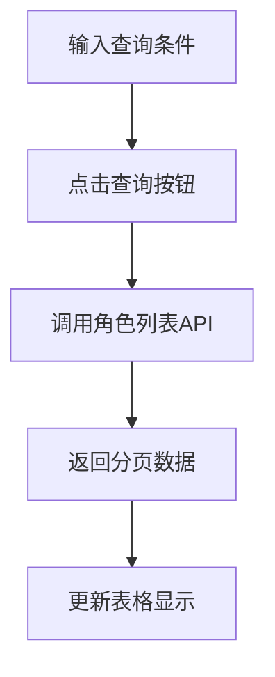
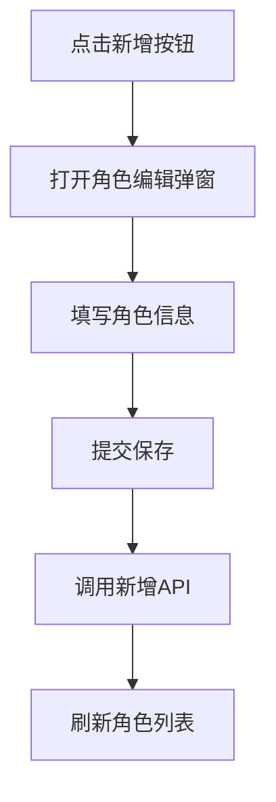
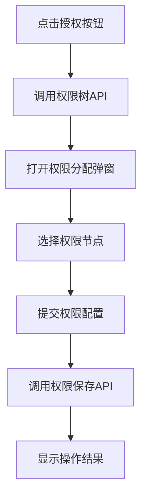
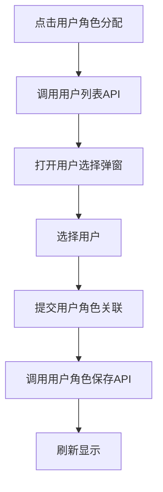

# 角色管理 PRD 文档

## 1. 模块概述

### 1.1 功能定位
角色管理模块是管理后台权限体系的核心组件，负责系统角色的创建、编辑、删除、权限分配等功能，为用户权限控制提供基础支撑。

### 1.2 业务价值
- 提供灵活的角色权限管理机制
- 支持多租户隔离的角色数据管理
- 实现角色与权限的精细化控制
- 支持角色的批量操作和导入导出

### 1.3 核心功能
- 角色列表查询与筛选
- 角色信息的增删改查
- 批量删除操作
- 角色权限分配
- 用户角色分配
- 导入导出功能
- 租户隔离管理

## 2. 前端页面结构

### 2.1 页面组件位置
- **前端页面路径**: `/src/views/system/RoleList.vue`
- **页面类型**: Vue2 + Ant Design Vue
- **混入组件**: JeecgListMixin

### 2.2 页面布局结构

#### 2.2.1 查询区域
```javascript
// 查询表单字段
queryParam: {
  roleName: '',      // 角色名称
  createTime: []     // 创建时间范围
}
```

#### 2.2.2 操作区域
- 新增角色按钮
- 批量删除按钮
- 导入/导出按钮

#### 2.2.3 数据表格
| 字段 | 标题 | 类型 | 说明 |
|------|------|------|------|
| roleName | 角色名称 | 文本 | 角色显示名称 |
| roleCode | 角色编码 | 文本 | 角色唯一标识码 |
| description | 描述 | 文本 | 角色功能描述 |
| createTime | 创建时间 | 日期时间 | 角色创建时间 |
| updateTime | 更新时间 | 日期时间 | 最后更新时间 |

#### 2.2.4 操作列
- 授权：打开权限分配弹窗
- 编辑：打开角色编辑弹窗
- 删除：删除当前角色

## 3. 页面交互流程

### 3.1 角色查询流程


### 3.2 角色新增流程


### 3.3 角色权限分配流程


### 3.4 用户角色分配流程


## 4. 数据结构分析

### 4.1 角色实体结构 (SysRole)
```java
// 核心字段
private String id;              // 主键ID
private String roleName;        // 角色名称
private String roleCode;        // 角色编码
private String description;     // 角色描述

// 系统字段
private String createBy;        // 创建人
private Date createTime;        // 创建时间
private String updateBy;        // 更新人
private Date updateTime;        // 更新时间

// 租户字段
private Integer tenantId;       // 租户ID（多租户隔离）
```

### 4.2 角色权限关联 (SysRolePermission)
```java
private String id;              // 主键
private String roleId;          // 角色ID
private String permissionId;    // 权限ID
private String dataRuleIds;     // 数据规则IDs
```

### 4.3 用户角色关联 (SysUserRole)
```java
private String id;              // 主键
private String userId;          // 用户ID
private String roleId;          // 角色ID
```

## 5. API接口分析

### 5.1 后端Controller路径
- **Controller类**: `org.jeecg.modules.system.controller.SysRoleController`
- **基础路径**: `/sys/role`

### 5.2 核心接口列表

#### 5.2.1 角色列表查询
- **接口路径**: `GET /sys/role/list`
- **功能**: 分页查询系统角色列表（不做租户隔离）
- **参数**: 
  - `pageNo`: 页码
  - `pageSize`: 页大小
  - `roleName`: 角色名称（模糊查询）
  - `createTime_begin`: 创建时间开始
  - `createTime_end`: 创建时间结束

#### 5.2.2 租户角色列表查询
- **接口路径**: `GET /sys/role/listByTenant`
- **功能**: 分页查询租户角色列表（做租户隔离）
- **参数**: 同上，自动添加租户过滤条件

#### 5.2.3 角色新增
- **接口路径**: `POST /sys/role/add`
- **功能**: 创建新角色
- **请求体**: 
```json
{
  "roleName": "角色名称",
  "roleCode": "角色编码",
  "description": "角色描述"
}
```

#### 5.2.4 角色编辑
- **接口路径**: `PUT /sys/role/edit`
- **功能**: 更新角色信息
- **请求体**: 同新增接口，需包含角色ID

#### 5.2.5 角色删除
- **接口路径**: `DELETE /sys/role/delete`
- **参数**: `id` - 角色ID
- **功能**: 删除单个角色及相关权限

#### 5.2.6 批量删除
- **接口路径**: `DELETE /sys/role/deleteBatch`
- **参数**: `ids` - 角色ID列表，逗号分隔
- **功能**: 批量删除角色

#### 5.2.7 角色详情查询
- **接口路径**: `GET /sys/role/queryById`
- **参数**: `id` - 角色ID
- **功能**: 根据ID查询角色详细信息

#### 5.2.8 查询全部角色
- **接口路径**: `GET /sys/role/queryall`
- **功能**: 查询所有角色（参与租户隔离）

#### 5.2.9 权限管理相关
- **权限树查询**: `GET /sys/permission/queryTreeList`
- **角色权限查询**: `GET /sys/role/queryRolePermission`
- **角色权限保存**: `POST /sys/role/saveRolePermission`

#### 5.2.10 导入导出
- **导出接口**: `GET /sys/role/exportXls`
- **导入接口**: `POST /sys/role/importExcel`

## 6. 后端业务逻辑

### 6.1 Service层核心方法

#### 6.1.1 角色删除 (deleteRole)
```java
void deleteRole(String roleId)
```
- 删除角色基本信息
- 清理角色权限关联
- 清理用户角色关联
- 清理部门角色关联

#### 6.1.2 批量删除 (deleteBatchRole)
```java
void deleteBatchRole(String[] roleIds)
```
- 批量删除角色
- 事务处理确保数据一致性
- 租户权限验证

#### 6.1.3 系统角色查询 (listAllSysRole)
```java
IPage<SysRole> listAllSysRole(Page<SysRole> page, SysRole role)
```
- 不做租户隔离的角色查询
- 支持条件筛选和分页

### 6.2 租户隔离逻辑
- **系统角色**: 不做租户隔离，所有租户可见
- **租户角色**: 严格租户隔离，只能操作本租户角色
- **权限验证**: 编辑删除时验证角色归属租户

### 6.3 权限控制逻辑
- 角色编码自动生成（多租户模式下）
- 超级管理员可操作所有角色
- 普通管理员只能操作本租户角色

## 7. 数据库结构

### 7.1 主要数据表

#### 7.1.1 sys_role (角色表)
- 存储角色基本信息
- 支持租户隔离字段 tenant_id
- 角色编码唯一性约束

#### 7.1.2 sys_role_permission (角色权限关联表)
- 角色与权限的多对多关联
- 支持数据权限规则配置

#### 7.1.3 sys_user_role (用户角色关联表)
- 用户与角色的多对多关联
- 支持一个用户分配多个角色

#### 7.1.4 sys_depart_role (部门角色关联表)
- 部门与角色的关联关系
- 支持部门级别的角色继承

## 8. 权限分配机制

### 8.1 权限树结构
- 菜单权限：页面访问控制
- 按钮权限：操作级别控制
- 数据权限：数据范围控制

### 8.2 权限继承规则
- 角色权限向用户传递
- 部门角色向部门用户传递
- 权限合并去重处理

### 8.3 权限缓存策略
- 用户权限信息缓存
- 角色权限变更时清理缓存
- 支持权限实时生效

## 9. 异常处理

### 9.1 业务异常
- 角色编码重复校验
- 角色删除前关联检查
- 租户权限验证失败
- 权限分配冲突处理

### 9.2 系统异常
- 数据库连接异常
- 事务回滚处理
- 并发操作冲突

### 9.3 前端异常处理
- 表单验证失败提示
- 权限不足提示
- 网络请求失败处理

## 10. 安全性能

### 10.1 安全措施
- 租户隔离验证
- 操作权限检查
- 敏感操作日志记录
- 角色权限变更审计

### 10.2 性能优化
- 角色列表分页查询
- 权限树懒加载
- 权限信息缓存
- 批量操作优化

## 11. 测试策略

### 11.1 功能测试
- 角色CRUD操作验证
- 权限分配功能测试
- 租户隔离测试
- 批量操作测试

### 11.2 权限测试
- 角色权限继承测试
- 用户权限验证测试
- 跨租户权限隔离测试

### 11.3 性能测试
- 大量角色查询性能
- 权限树加载性能
- 并发权限分配测试

## 12. 代码位置索引

### 12.1 前端代码
- **页面组件**: `/src/views/system/RoleList.vue`
- **API封装**: `/src/api/api.js` (roleApi相关方法)
- **权限组件**: `/src/components/permission/` (权限树组件)

### 12.2 后端代码
- **Controller**: `/jeecg-module-system/jeecg-system-biz/src/main/java/org/jeecg/modules/system/controller/SysRoleController.java`
- **Service接口**: `/jeecg-module-system/jeecg-system-biz/src/main/java/org/jeecg/modules/system/service/ISysRoleService.java`
- **Service实现**: `/jeecg-module-system/jeecg-system-biz/src/main/java/org/jeecg/modules/system/service/impl/SysRoleServiceImpl.java`
- **Entity实体**: `/jeecg-module-system/jeecg-system-biz/src/main/java/org/jeecg/modules/system/entity/SysRole.java`
- **Mapper接口**: `/jeecg-module-system/jeecg-system-biz/src/main/java/org/jeecg/modules/system/mapper/SysRoleMapper.java`

### 12.3 权限相关代码
- **权限Controller**: `/jeecg-module-system/jeecg-system-biz/src/main/java/org/jeecg/modules/system/controller/SysPermissionController.java`
- **角色权限Service**: `/jeecg-module-system/jeecg-system-biz/src/main/java/org/jeecg/modules/system/service/ISysRolePermissionService.java`
