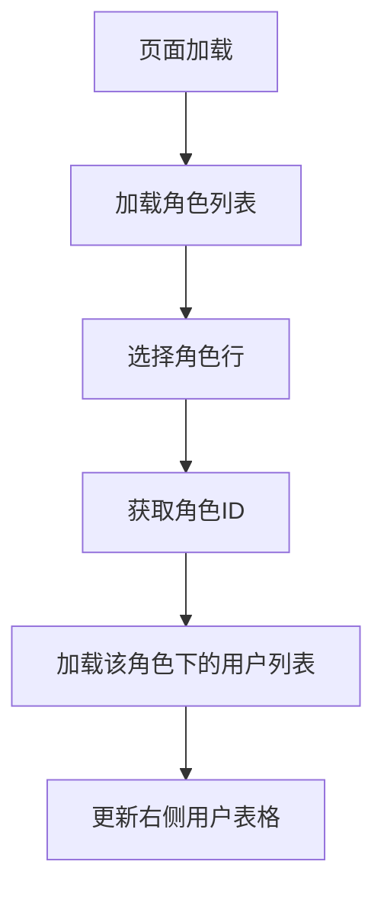
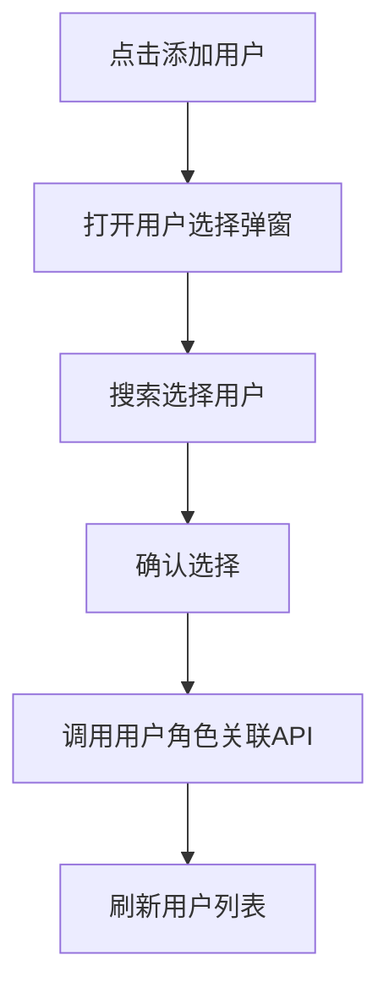
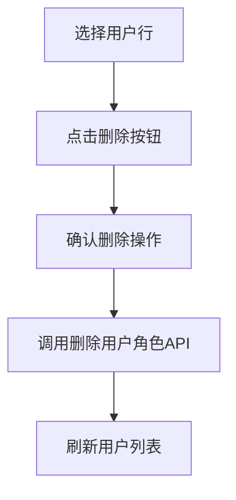
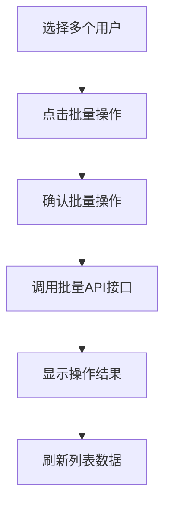

# 角色维护 PRD 文档

## 1. 模块概述

### 1.1 功能定位
角色维护模块是管理后台权限管理的重要组成部分，专门负责角色与用户之间的关联关系管理，提供直观的双表格界面来维护用户的角色分配。

### 1.2 业务价值
- 提供可视化的角色用户关联管理界面
- 支持批量用户角色分配和移除
- 实现角色权限的精细化用户分配
- 提供高效的角色用户关系维护工具

### 1.3 核心功能
- 双表格显示：角色列表 + 用户列表
- 角色选择和切换
- 用户角色关联的增删操作
- 批量用户角色分配
- 用户搜索和筛选
- 导入导出功能

## 2. 前端页面结构

### 2.1 页面组件位置
- **前端页面路径**: `/src/views/system/RoleUserList.vue`
- **页面类型**: Vue2 + Ant Design Vue
- **布局特点**: 双表格横向布局

### 2.2 页面布局结构

#### 2.2.1 左侧角色表格
```javascript
// 角色查询参数
roleQueryParam: {
  roleName: '',      // 角色名称
  createTime: []     // 创建时间范围
}

// 角色表格列
roleColumns: [
  { title: '角色名', dataIndex: 'roleName' },
  { title: '角色编码', dataIndex: 'roleCode' },
  { title: '描述', dataIndex: 'description' },
  { title: '创建时间', dataIndex: 'createTime' },
  { title: '操作', scopedSlots: { customRender: 'action' } }
]
```

#### 2.2.2 右侧用户表格
```javascript
// 用户查询参数
userQueryParam: {
  username: '',      // 用户账号
  realname: ''       // 真实姓名
}

// 用户表格列
userColumns: [
  { title: '用户账号', dataIndex: 'username' },
  { title: '用户姓名', dataIndex: 'realname' },
  { title: '头像', dataIndex: 'avatar' },
  { title: '性别', dataIndex: 'sex' },
  { title: '手机', dataIndex: 'phone' },
  { title: '邮箱', dataIndex: 'email' },
  { title: '状态', dataIndex: 'status' },
  { title: '操作', scopedSlots: { customRender: 'action' } }
]
```

#### 2.2.3 操作区域
**左侧角色操作**:
- 新增角色按钮
- 批量删除按钮
- 导入/导出按钮

**右侧用户操作**:
- 添加用户按钮
- 批量删除按钮
- 批量添加用户角色

## 3. 页面交互流程

### 3.1 角色选择流程


### 3.2 用户角色分配流程


### 3.3 用户角色移除流程


### 3.4 批量操作流程


## 4. 数据结构分析

### 4.1 角色用户关联视图数据
```javascript
// 角色列表数据结构
roleList: [
  {
    id: "角色ID",
    roleName: "角色名称",
    roleCode: "角色编码", 
    description: "角色描述",
    createTime: "创建时间",
    updateTime: "更新时间"
  }
]

// 用户列表数据结构
userList: [
  {
    id: "用户ID",
    username: "用户账号",
    realname: "真实姓名",
    avatar: "头像路径",
    sex: "性别",
    phone: "手机号",
    email: "邮箱",
    status: "状态"
  }
]
```

### 4.2 用户角色关联操作数据
```javascript
// 添加用户角色请求
{
  roleId: "角色ID",
  userIds: "用户ID列表,逗号分隔"
}

// 删除用户角色请求  
{
  roleId: "角色ID",
  userId: "用户ID"
}

// 批量删除用户角色请求
{
  roleId: "角色ID", 
  userIds: "用户ID列表,逗号分隔"
}
```

## 5. API接口分析

### 5.1 后端接口路径
- **角色相关**: `/sys/role/*`
- **用户角色关联**: `/sys/user/*`

### 5.2 核心接口列表

#### 5.2.1 角色列表查询
- **接口路径**: `GET /sys/role/list`
- **功能**: 查询角色列表数据
- **参数**: 
  - `pageNo`: 页码
  - `pageSize`: 页大小
  - `roleName`: 角色名称筛选

#### 5.2.2 角色用户列表查询
- **接口路径**: `GET /sys/user/userRoleList`
- **功能**: 查询指定角色下的用户列表
- **参数**:
  - `pageNo`: 页码
  - `pageSize`: 页大小
  - `roleId`: 角色ID
  - `username`: 用户账号筛选
  - `realname`: 真实姓名筛选

#### 5.2.3 添加用户角色关联
- **接口路径**: `POST /sys/user/addSysUserRole`
- **功能**: 为角色添加用户关联
- **请求体**:
```json
{
  "roleId": "角色ID",
  "userIds": "用户ID1,用户ID2,用户ID3"
}
```

#### 5.2.4 删除用户角色关联
- **接口路径**: `DELETE /sys/user/deleteUserRole`
- **参数**:
  - `roleId`: 角色ID
  - `userId`: 用户ID
- **功能**: 删除单个用户的角色关联

#### 5.2.5 批量删除用户角色关联
- **接口路径**: `DELETE /sys/user/deleteUserRoleBatch`
- **参数**:
  - `roleId`: 角色ID
  - `userIds`: 用户ID列表，逗号分隔
- **功能**: 批量删除用户角色关联

#### 5.2.6 角色操作接口
- **角色删除**: `DELETE /sys/role/delete`
- **角色批量删除**: `DELETE /sys/role/deleteBatch`
- **角色导出**: `GET /sys/role/exportXls`
- **角色导入**: `POST /sys/role/importExcel`

## 6. 后端业务逻辑

### 6.1 用户角色关联管理

#### 6.1.1 添加用户角色关联 (addSysUserRole)
```java
@RequestMapping(value = "/addSysUserRole", method = RequestMethod.POST)
public Result<String> addSysUserRole(@RequestBody SysUserRoleVO sysUserRoleVO)
```
- 验证角色和用户的有效性
- 检查是否已存在关联关系
- 批量插入用户角色关联记录
- 租户权限验证

#### 6.1.2 删除用户角色关联 (deleteUserRole)
```java
@RequestMapping(value = "/deleteUserRole", method = RequestMethod.DELETE)
public Result<SysUserRole> deleteUserRole(String roleId, String userId)
```
- 验证角色和用户的关联关系
- 删除指定的用户角色关联
- 更新用户权限缓存

#### 6.1.3 批量删除用户角色关联 (deleteUserRoleBatch)
```java
@RequestMapping(value = "/deleteUserRoleBatch", method = RequestMethod.DELETE) 
public Result<SysUserRole> deleteUserRoleBatch(String roleId, String userIds)
```
- 解析用户ID列表
- 批量删除用户角色关联
- 事务处理确保数据一致性

### 6.2 角色用户列表查询 (userRoleList)
```java
@RequestMapping(value = "/userRoleList", method = RequestMethod.GET)
public Result<IPage<SysUser>> userRoleList(Integer pageNo, Integer pageSize, HttpServletRequest req)
```
- 根据角色ID查询关联用户
- 支持用户信息筛选
- 分页返回用户列表数据
- 租户隔离处理

### 6.3 权限缓存更新
- 用户角色关联变更时清理相关缓存
- 实时更新用户权限信息
- 支持集群环境下的缓存同步

## 7. 数据库结构

### 7.1 主要数据表

#### 7.1.1 sys_user_role (用户角色关联表)
```sql
CREATE TABLE sys_user_role (
  id VARCHAR(32) NOT NULL PRIMARY KEY,
  user_id VARCHAR(32) NOT NULL COMMENT '用户ID',
  role_id VARCHAR(32) NOT NULL COMMENT '角色ID',
  UNIQUE KEY uk_user_role (user_id, role_id)
);
```

#### 7.1.2 关联查询逻辑
- 通过 sys_user_role 表关联 sys_user 和 sys_role
- 支持一个用户拥有多个角色
- 支持一个角色分配给多个用户

### 7.2 查询优化
- user_id 和 role_id 建立联合索引
- 分页查询优化大数据量场景
- 关联查询性能优化

## 8. 页面状态管理

### 8.1 选中状态管理
```javascript
data() {
  return {
    selectedRoleId: '',           // 当前选中的角色ID
    selectedRoleRowKeys: [],      // 角色表格选中行
    selectedUserRowKeys: [],      // 用户表格选中行
    roleList: [],                 // 角色列表数据
    userList: [],                 // 用户列表数据
    rolePagination: {},           // 角色分页信息
    userPagination: {}            // 用户分页信息
  }
}
```

### 8.2 交互状态同步
- 角色选择时自动加载对应用户
- 用户操作后刷新列表数据
- 保持分页和筛选状态

## 9. 异常处理

### 9.1 业务异常
- 角色不存在或已删除
- 用户不存在或已删除
- 用户角色关联已存在
- 权限不足无法操作

### 9.2 界面异常处理
- 网络请求失败提示
- 数据加载失败处理
- 操作确认和结果反馈
- 表格数据为空的友好提示

### 9.3 并发处理
- 防止重复提交操作
- 数据变更冲突处理
- 乐观锁机制应用

## 10. 安全性能

### 10.1 安全措施
- 租户隔离验证
- 用户角色操作权限检查
- 敏感操作审计日志
- 防止越权操作

### 10.2 性能优化
- 分页加载减少数据量
- 角色切换时的数据缓存
- 批量操作性能优化
- 前端虚拟滚动支持大列表

## 11. 测试策略

### 11.1 功能测试
- 角色用户关联的增删操作
- 批量操作功能验证
- 分页和搜索功能测试
- 权限验证测试

### 11.2 界面测试
- 双表格布局响应式测试
- 交互操作流畅性测试
- 数据同步准确性测试

### 11.3 性能测试
- 大量数据加载性能
- 频繁切换角色的性能
- 批量操作的性能测试

## 12. 代码位置索引

### 12.1 前端代码
- **页面组件**: `/src/views/system/RoleUserList.vue`
- **API封装**: `/src/api/api.js` (用户角色相关API)
- **组件样式**: 页面内部样式定义

### 12.2 后端代码
- **用户Controller**: `/jeecg-module-system/jeecg-system-biz/src/main/java/org/jeecg/modules/system/controller/SysUserController.java`
  - `userRoleList` 方法 (行979-990)
  - `addSysUserRole` 方法 (行999-1025)
  - `deleteUserRole` 方法 (行1031-1050)
  - `deleteUserRoleBatch` 方法 (行1055-1075)
- **角色Controller**: `/jeecg-module-system/jeecg-system-biz/src/main/java/org/jeecg/modules/system/controller/SysRoleController.java`
- **用户角色Service**: `/jeecg-module-system/jeecg-system-biz/src/main/java/org/jeecg/modules/system/service/ISysUserRoleService.java`

### 12.3 数据库脚本
- **关联表结构**: `/db/shop-boot/shop-boot-member.sql` (sys_user_role表)
- **索引优化脚本**: 用户角色关联表的性能优化索引

---

**文档版本**: v1.0  
**编写日期**: 2024年  
**维护人员**: 系统开发团队  
**审核状态**: 待审核
